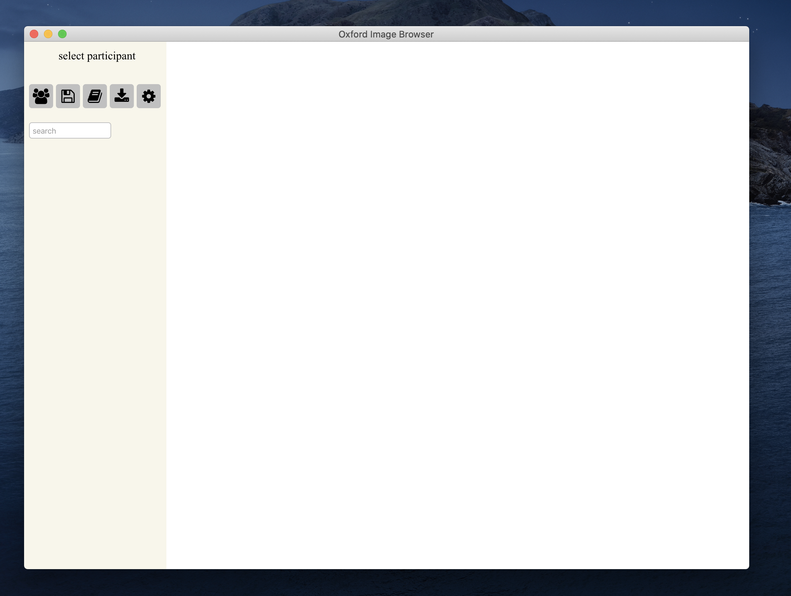

# Practical 3 part II: A Day in Life of a CDT Student

### Overview

In this practical, you will go through the annotation training so that you are equibbed to label images under a specific annotation scheme to identify Activities of Daily Living (ADLs).

You'll be provided with a dataset of images from a few past study subjects, and you will annotate them using a research software developed by us.

Today you should have the `prac3` directotry in your local 'wearables' directory, 


<!-- TODO: copy train images to `prac3`.  -->

## 1. Setup and installation

We first need to set up the image browser.

* Move `OxfordImageBrowser` to your Applications folder. 

* Double click `OxfordImageBrowser` to launch the annotation software. Launching this for the first time should take 1-2 minutes. Once it has been loaded properly you should see a window like this 



* Hover your cursor over the different icons to familiarize yourself with the available functions. 

* Quit the browser. 


Next, we need to copy over the schema and set up the test image files we need for the annotation training. 


Open your terminal and the following commands expects you to be located in your `wearables/prac3` folder. 

*   To move the schema files: 
```
$ mv schema/* /Users/<yourName>/OxfordImageBrowser/schema/
```

<!-- * To set up the test images, first resize them for each test subject,

    ```
    $ cd ../scripts
    $ bash create_thumbnails.sh ../prac3/images-to-annotate/train1
    $ bash create_thumbnails.sh ../prac3/images-to-annotate/train2
    $ bash create_thumbnails.sh ../prac3/images-to-annotate/train3
    ``` -->

* Then move the test images to your the Browser input folder.

    ```
    $ mv images-to-annotate/* /Users/<yourName>/OxfordImageBrowser/images/
    ```


### Folder structure

We will now walk through how the browser reads in the images for annotation. Our setup has created a new directory in your root folder at `/Users/{yourName}/OxfordImageBrowser`, this further contains 3 folders: `annotations`,`images`, `schema`.

* `images/`

    This is where you store images which you want to annotate. You should have a folder structure like this. 

    ```python
        /Users/<yourName>/OxfordImageBrowser/images/
            participantID/
                AAAAAAAAA_BBBBBB_YYYYMMDD_HHMMSSE.JPG
                ...
    ```

* `schema/`

    This is where you will store csv files which specify your annotation schemes. 

    You should have 3 schema .csv files (7class, annotation, social), along with a template for free text annotation. For the purpose of these practicals, do not edit any of these files except for `free_text.csv`. 

    Should you want to define your own schema, simply copy one of the existing ones and add/remove rows as you see fit. You can use either a text editor (Notepad), or Excel. If using Excel make sure to save as .csv filetype, as .xls files will not be recognised.

    Your annotation training will focus on the schema `annotation.csv`, which is a specific set of activities based on the [Compendium of Physical Activities](https://sites.google.com/site/compendiumofphysicalactivities/home). Have a browse at this file to check the available activity labels.


* `annotation/`

    This is where the Browser outputs your annotation files by default. A sub-folder will be created for each participant found in `images/`. 


## 2. Annotation Training 

Now you are ready to undergo the annotation training! 

All previous annotators of the CAPTURE-24 dataset had to go through extensive training - labelling at least 8 test subjects - before they can go on to label other data. Today you will have a taste of this by annotating your own data. You will want to evaluate your performance against a yourself at a different time or with someone else, and you're expected to achieve above 80\%.  

Please go through Part C & D of the document `prac3/camera-supplement-apr18.pdf` to understand how you should annotate the images. 


### Protocol

* Start the image browser. 

* Click on the leftmost participant selection icon. You should see it reflecting the updatetd list of test participants. 

* For each participant:
    
    * Select the participant

    * Select the annotation scheme `annotation.csv`

    * Annotate all images belonging to the participant (see Annotation instructions)

    * When finished, check the top bar to ensure annotation is 100% complete. 

    * Check that the annotation CSV file has been automatically saved to the default location (inside `annotations/{trainID}`); If not, manually save the annotations by clicking the download botton.

    * Evaluate your annotations (see Evaluation instructions.)

* When you have completed the training, empty all test images:

```
$ rm -r ~/OxfordImageBrowser/images/* 
```

#### Annotating images.

The overall flow is:

1. Divide up the images into different events/activities by clicking on the timeline above the images.

* To move event boundaries, click and drag the circles. 

* For instance this split is where I think the participant has started locking up their bike.

{ width=650px }


2. Look at consecutive images to determine the most suitable label for each image sub-sequence. You can also make use of the search bar if you are unsure where the labels are located in the hierarchy.

3. Pull the selected label onto the image(s). To change an activity label simply drag another label over it.


#### Evaluating annotations.
If you have the rating from another person, you could compute the inter-rater kappa via the command below:
* Run this from your terminal in the folder `wearables/prac3/`

```
$ python kappaScoring.p y ~/OxfordImageBrowser/annotation/{trainID}/{trainID}-annotation.csv 
```

* Review your performance by opening `~/OxfordImageBrowser/annotation/{trainID}/{trainID}-annotation-feedback.html` in your preferred browser.

* You should aim to achieve at least 80\%.