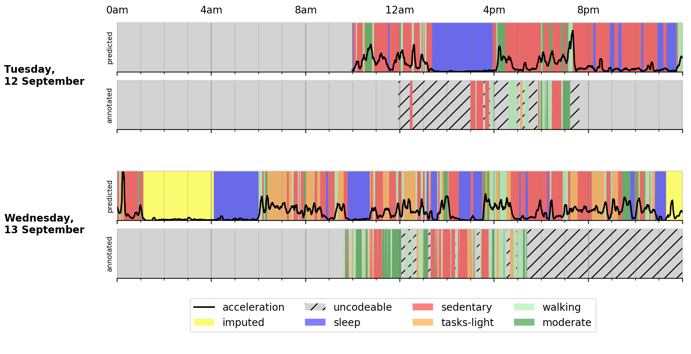
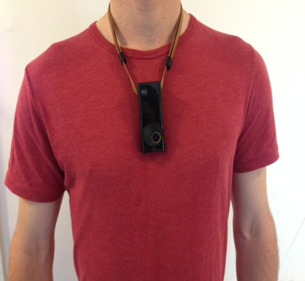
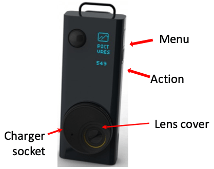
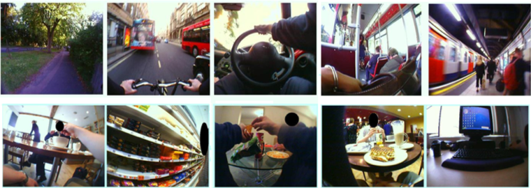
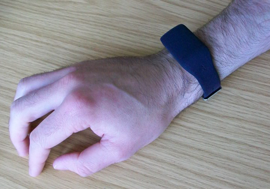
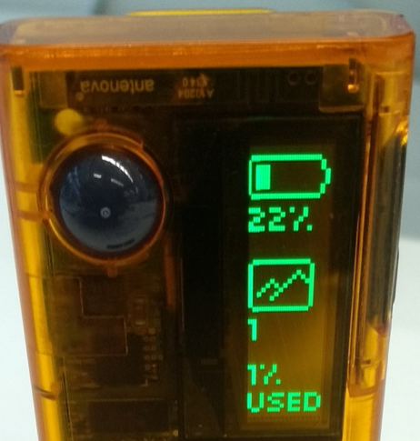

# Practical 1: Fundamentals of Sensing, Setting up devices

### Overview
Over the next couple of days, you will be collecting and analyzing your own data using 2 devices: a wearable camera and an accelerometer.

By going through this practical, we hope that you will learn more about how innovative technologies such as wearable cameras and acceleromoters are being used in health and social research. You might also find it interesting to see how many different activities you do in a day and where you spend the majority of your time.

Our road map will look like this:

1. Ethics training. Set up devices and collect your own data.
2. Annotation training.
3. Extract and annotate two days worth of data from your devices.
4. Time-series analysis and machine learning.
5. Visualize your data! See a motivating end product below:



### Today
In this practical, we'll go through an ethics training and set up your devices to collect data. By the end of the practical, you will be wearing your devices for two days until Practical 3, when you will begin analysis and visualisation of your very own data.

### Miscellaneous
All the commands will work on Linux and Mac. First, you will need to clone the repo on your own machine by:
```
$ git clone https://github.com/activityMonitoring/wearable-teaching.git
```


# 1. Ethics Training.
As you may be aware, various ethical issues can stem from research using image-based data. It is important that all researchers involved go through an ethics training to familiarise themselves of related ethical issues.

Your ethics training will consists of going through a list of necessary reading materials as well as passing an online certificated course.


### A. Reading list
* Background Information.

* Kelly, P., Marshall, S.J., Badland, H., Kerr, J., Oliver, M., Doherty, A.R., Foster, C. (2013) [An Ethical Framework for automated-wearable cameras in health behaviour research](https://mhealth.md2k.org/images/Pdfs/Kelly_etal.pdf). American Journal of Preventive Medicine 44(3); 314-319

* Parts A & B of Cox, S. Drew, S. Guillemin, M. Howell, C. Warr, D. and Waycott, J. (2014) [Guidelines for Ethical Visual Research Methods](https://socialequity.unimelb.edu.au/__data/assets/pdf_file/0006/1981392/Ethical-Visual-Research-Methods-WEB.pdf), The University of Melbourne, Melbourne

* Doherty, A.R., Williamson, W., Hillsdon, M., Hodges, S., Foster, C., Kelly, P. (2013) [Influencing health-related behaviour with wearable cameras: strategies & ethical considerations](https://dl.acm.org/doi/pdf/10.1145/2526667.2526677). Proceedings of SenseCam and Pervasive Imaging Conference, San Diego, USA, November 18-19, 2013


### B. Ethics Training Course [optional]
Complete the [Ethics Training Course](https://weblearn.ox.ac.uk/access/content/group/52eb73ab-d173-4c69-99a9-0eff1fd21574/2017/01_bio_int_imscp/01_bio/index_01_bio.html). Once you have passed the course quiz (scoring at least 90%), you will receive a certificate in your Oxford email.

**Handin:** Forward course certicifate to [Hang](hang.yuan@keble.ox.ac.uk).


### Declaration
You will need to complete the ethical declaration form in order to continue. This can be found at `practicals/prac1_data_collection/declaration.pdf`

NB. Aiden Doherty is the Principal Investigator.

**Handin:** Ethical Declaration (hard copy of `practicals/prac1_data_collection/declaration.pdf`) to Hang.


# 2. About your study.
The idea of this study is for you to create your own dataset using the wearable camera and accelerometer in order to have a taste of studies of this kind.

Please take a moment to go through the following background information before you begin collecting data. The text is chiefly about the wearable camera and has been adapted from an information sheet given to actual participants of the [CAPTURE-24 study](https://journals.sagepub.com/doi/abs/10.1177/0081175019884591) in 2015.


### Camera
 

* Wear the camera around your neck so that it feels comfortable. The camera unit should be at chest height with the lens facing horizontally forwards.
* The height can be adjusted with the black cord (lanyard).
* Wear the camera outside of your clothes and be careful that your coat doesn’t obscure the lens!
* There is also a clip, if you prefer to attach the camera to clothes.
* Do not get the camera wet.
* The camera is not suitable for prolonged running or jogging or other very energetic activities.
* The camera does not recrord any sounds, voices or conversations.
* All images should be treated with the strictest confidence and you will be given the option to review and delete any or all images before analysis
* Do not treat the device as a hand-held camera or attempt to capture specific angles.
* The lens cover can be rotated to give privacy when required. You do not need to turn the camera off. Remember to turn the lens cover back to allow images to be taken once you no longer need privacy. Some people find it easier to hide the camera under their clothing or in a pocket for short periods of privacy.
* Please take off and charge the camera during sleep.

In a typical day of wear, the camera may take up to 3,000 images depicting your everyday life, where you go and the kinds of activities you engage in (e.g. walking to the shop, cycling, socialising). Some images are displayed below for you to get an idea of the content and quality of images that are recorded:



You are free to take off or pause the device at any time, without giving a reason. You should not feel obliged to wear the device in situations where wearing it may make you (or others) feel uncomfortable. If others around you feel uncomfortable with you wearing the camera, you should offer to remove or temporarily switch it off. Places where wearing the camera may not be appropriate include changing rooms, swimming pools, or in and around schools. Data of illegal activities may not be protected by confidentiality and may be passed to law enforcement. The camera does not record sound, voices, or conversations, so your privacy is assured in this regard.

We recommend that you check in advance that friends, family, and co-workers understand the nature of the study and are happy for you to take part. Their behaviour will not be reported as part of the research and images of them will never be shown without your and their written permission. They are welcome to contact the research team if they have any questions or concerns. If you are worried that the camera may have taken images of others that they would feel uncomfortable with, both you and the third party are free to request for those images to be deleted without giving any reason.

Over the course of the data collection day you may forget you are wearing the camera and take images that are too personal, unwanted or unflattering. At the end of the period for which you are wearing the camera, you will have the opportunity to view and, if necessary, delete any images that you do not wish to be included in the study. You will have the option of doing this either in private or with the help of a researcher. As the images are research data, you will not be able to keep any copies of the images.

#### Personal safety
Remove the camera in any situation where you feel unsafe. For example, if you happen to be out on your own late at night, you may prefer to hide the camera to avoid unwanted attention. If someone tries to take the camera off you do not attempt to stop them.

If you are engaged in certain manual tasks or using machinery the camera sometimes swings around. For example, if you are using gardening machinery, we advise you remove the device until the activity is finished to avoid discomfort or the possibility of the device getting caught in a dangerous way.

#### Do I have to collect my own data?
You are of course free to decide whether or not to collect your own data. There will be no penalty to you for not doing so.

#### Where and when should and shouldn’t I wear the camera?
This is a good opportunity to collect your daily activities so we encourage you to wear the camera as much as possible during your waking hours for one day. Once you have woken and showered put on the camera. Please keep it on until you start preparing for bed that evening; you do not have to wear it whilst you are sleeping. You should not wear the camera while you or others are changing or undressing.

We appreciate that in some places (e.g. hospitals or airports) it may not be appropriate to wear the camera and you should feel free to remove it at any time. You do not need to wear the camera while participating in contact or water based sports (e.g. rugby or swimming), although it would be good to record your journey there and back.

#### What are the possible disadvantages of collecting this data?
We do not anticipate any significant effects on your lifestyle. If you do not want to answer any of the questions in the questionnaire or interview you do not have to. You will also be able to check and delete any images taken prior to anyone viewing the images. However, it is possible that while wearing the camera you may be asked about the device by members of the public. In this case we suggest that you say the following:

“I am volunteering for a research project. The device is a wearable camera and the images will be used to record my daily activities. I am happy to remove it if you would like me to.”

You may also print out a wallet-size card which includes this statement and contact information for you to show others.


### Accelerometer
The accelerometer is extremely robust and should be worn at all times. Do not worry if this is not a typical time for you (e.g. you are doing more or less physical activity than normal). Please start wearing it as soon as we give it to you. The accelerometer has a long battery life (at least a week), so you do not need to charge it. As it is completely silent, you will not be able to tell that it is running.

**Please wear the accelerometer on the wrist of the hand that you usually use to write (i.e. your right wrist if you are right-handed)**. Generally this will be most convenient for people since it is typical to wear a watch on the other wrist. However, if for some reason you cannot wear the accelerometer on the wrist of the hand that you use to write, then please wear it on the other wrist. The heart-beat symbol should be on the inside of your wrist (i.e. facing towards you).

The accelerometer is robust and water-proof, and has been designed to be worn when working or sleeping, having a bath or shower, or playing all types of sport (including swimming). Extremes of temperature may damage the battery so it should be taken off while you have a sauna.




# 3. Setting up the devices.
Now collect your devices from Hang, who will go through the accelerometer set-up with you.

You should have been given 1 wearable camera (Vicon Autographer), 1 wrist-worn accelerometer (and 1 micro-USB cable).

### Requirements
Before we begin, let's take a moment to install the a Python package `tqdm` that we will need today. You're also expected to use Python 3.6. Open Terminal and run:  
<!--
```
$ pip install -r requirements.txt
``` -->

```
$ pip install tqdm
```


### Accelerometer
Your accelerometer has already been set up to record data at 100Hz. The local time of the accelerometer has been synced to Hang's computer.


### Camera
To set up the camera, you will run a script to ensure the camera has a correct local time and that it does not contain any past data. The time syncing step is important for you to correctly align the accelerometer and camera data.

The time syncing is based on your Mac's local time - so it is expected to be in UK time and not to deviate too much from the time on Hang's computer. You should also run the script as soon as your camera is plugged in to minimise any time lag.

Open your terminal and run these commands to set up your camera:

* Navigate to `practicals/scripts`, we will use the script `autographer.py` located inside your `scripts` folder.

* Plug in your camera to your Mac

* __IMPORTANT: Run this immediately after the camera is plugged in__
```
$ python autographer.py --setup True
```

* You can now safely unplug the device.


<!-- collect your devices from Catherine (desk G065) who will set up your accelerometer for you. Fill in this form to register the IDs of your devices. [todo]  -->


### Camera operating instructions
| Turn on / off       | Press the “ACTION” button to the side of the device for a few seconds. The screen will say 'hello'/ 'goodbye'. |
| ------------- |:-------------:|
| Camera Status      | Press the “MENU” button for an update on the battery status, number of pictures taken, and amount of memory space used. |


Turn the camera on, and check that only the screen below shows when pressing the 'Menus' button:




<!-- ## 4. Generating data for basic activities. TODO

Please perform the following sets of activities for 5 minutes each. -->


# 4. Collecting your own data in-the-wild
Now that you've set up the devices, you can go ahead with your day as normal to collect data! Please wear your devices for two days until Practical 3, when you will begin analysis and visualisation of your very own data!


# Handin
See the bolded "**Handin:**" parts above. On paper or verbally, show a practical demonstrator your response to these to get signed off.
