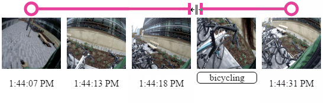
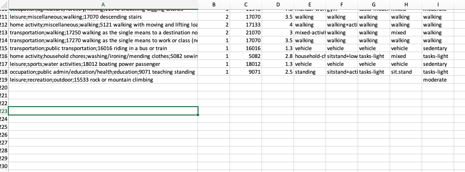

# Pratical 2: Processing wearable camera data
In this practical, you will process data collected from your wearable camera.


## 1. Setup and installation
Navigate to the `oxford-wearable-camera-browser` folder that you installed during the first practical.

### Folder structure
We will now walk through how the browser reads in the images for annotation. Our setup has created a new directory in your root folder at `/Users/{yourName}/OxfordImageBrowser/`, this further contains 3 folders: `annotations`,`images`, `schema`.

* `images/`

    This is where you store images which you want to annotate. You should have a folder structure like this.

    ```python
        /Users/<yourName>/OxfordImageBrowser/images/
            participantID/
                AAAAAAAAA_BBBBBB_YYYYMMDD_HHMMSSE.JPG
                ...
    ```

* `schema/`

    This is where you will store csv files which specify your annotation schemes.

    You should have 3 schema .csv files (7class, annotation, social), along with a template for free text annotation. For the purpose of these practicals, do not edit any of these files except for `free_text.csv`.

    Should you want to define your own schema, simply copy one of the existing ones and add/remove rows as you see fit. You can use either a text editor (Notepad), or Excel. If using Excel make sure to save as .csv filetype, as .xls files will not be recognised.

    Your annotation training will focus on the schema `annotation.csv`, which is a specific set of activities based on the [Compendium of Physical Activities](https://sites.google.com/site/compendiumofphysicalactivities/home). Have a browse at this file to check the available activity labels.


* `annotation/`

    This is where the Browser outputs your annotation files by default. A sub-folder will be created for each participant found in `images/`.


## 2. Extracting data

We now want to extract the raw images from your camera. We'll perform the following from the `utilities` folder within `oxford-wearable-camera-browser`.

* Plug in your camera. To download the photos:

```
$ cd ~/Development/oxford-wearable-camera-browser/utilities/
$ python3 autographer.py --download True --destDir ~/OxfordImageBrowser/images/<your_name>
```

* Safely disconnect the device and **put your camera back on!**

* Then generate resized versions of your photos. You first need to install 'imagemagick' via Homebrew ([installation instructions for Homebrew here](https://brew.sh/)).

```
$ brew install imagemagick
```

Then to resize: (this could take about 10 minutes to run)
```
$ bash create_thumbnails.sh ~/OxfordImageBrowser/images/<your_name>/
```


## 3. Annotating your own data

Now you can open `OxfordImageBrowser` and annotate your own data based on the instructions in `annotation.pdf`.

* Start the image browser.

```
$ cd ~/Development/oxford-wearable-camera-browser/
$ npm start
```

* Click on the leftmost participant selection icon. You should see it reflecting the updated list of test participants.

* For each participant:

    * Select the participant i.e. you

    * Select the annotation scheme `annotation.csv`

    * Annotate all images belonging to the participant (see instructions just below)

    * When finished, check the top bar to ensure annotation is 100% complete.

    * Check that the annotation CSV file has been automatically saved to the default location (inside `~/OxfordImageBrowser/annotations/<your_name>/`); If not, manually save the annotations by clicking the download button.


### Annotating images.
All previous annotators of the CAPTURE-24 dataset had to go through extensive training - labelling at least 8 test subjects - before they can go on to label other data. We will not subject you to that experience! However, today you will get a taste of this by annotating your own data. To start with, please go through parts C & D of [this supplementary document](https://static-content.springer.com/esm/art%3A10.1038%2Fs41598-018-26174-1/MediaObjects/41598_2018_26174_MOESM2_ESM.docx) from [this paper](https://www.nature.com/articles/s41598-018-26174-1) to understand how you should annotate the images.

The overall flow is [described in great detail here](https://github.com/activityMonitoring/oxford-wearable-camera-browser) where the essential elements are to:

1. Divide up the images into different events/activities by clicking on the timeline above the images.

  * To move event boundaries, click and drag the circles.

  * For instance this split is where I think the participant has started locking up their bike.




2. Look at consecutive images to determine the most suitable label for each image sub-sequence. You can also make use of the search bar if you are unsure where the labels are located in the hierarchy.

3. Pull the selected label onto the image(s). To change an activity label simply drag another label over it.


After annotating your own data using the scheme `annotation.csv`, please perform the following annotation exercises.

<!-- 1. `7class.csv`: similar to what you did with `annotation.csv`. -->

1. `social.csv`: annotate events which you think are of a social nature (e.g. having lunch with friends) versus those which are not.

2. `free_text.csv`: In the previous exercises, you have been confined by the definition of the labels to define 'events' / 'activities' within your day. In this case, could you come up with your own description or annotation labels and divide up your image timeline according to what feels most natural to you? You would need to put your event labels / descriptions into a CSV file, and drag these to label your events. The current `free_text.csv` has been provided as an example but be creative.

3. Write a 1-liner summary for each day. Save this as a `per_day.csv` file where you have one line per row. Divide up your time line

At the end of these exercises, you should have 4 annotation CSV files saved in your `OxfordImageBrowser/annotation/me` directory.

<!-- browser_dir = '/Users/<yourName>/OxfordImageBrowser/annotation/me/' -->

Copy the `my-annotations.csv` file over to your `~/Development/wearable-teaching/practicals/data/` folder.


### Uncodeable Activities

In your resulting time-series file, you might notice that some of your annotations are 'uncodeable'. Here are some ways to fix this.

1. Sleep

Do the following if you want your annotated time series to have 'sleep' events.

Open your annotations file at `~/Development/wearable-teaching/practicals/data/my-annotations.csv` and manually change the label of the events you believe correspond to your sleeping hours into `7030 sleeping`.

2. Other Events

Do the following if you notice that there are other events in your time series which you have annotated but appears to be 'uncodeable' in your plot.

Open the labels file at `~/Development/wearable-teaching/practicals/data/prac2-camera/label-dictionary.csv` and manually append the table.

For example, 'leisure;recreation;outdoor;15533 rock or mountain climbing' is not currently in the label dictionary. Append the table, putting 'leisure;recreation;outdoor;15533 rock or mountain climbing' in the 'annotation' column, and a category which you feel is appropriate under the 'NatComms-label-simplified' column (in this case I've assigned the latter as moderate):




**Handin:** Return the camera and accelerometer to Hang by the end of the practical. He will take care of clearing your accelerometer data.
