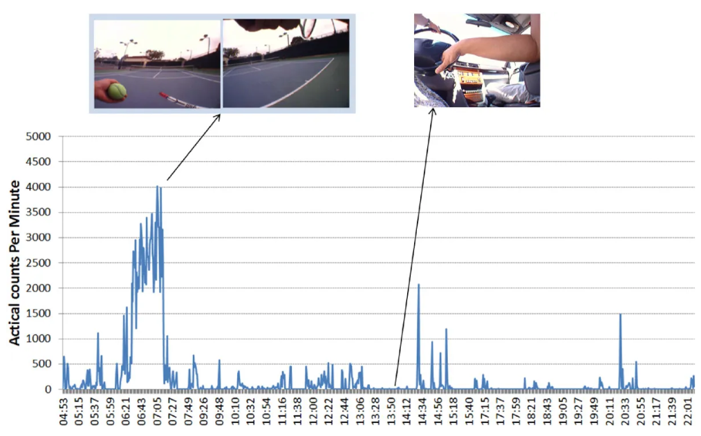

# Practical 3: Processing accelerometer data
In this practical, you will process data collected from your accelerometer.


## 1. Setup and installation
First need to get some scripts for the pre-processing of your accelerometer data. You can install the below package anywhere you like e.g. ~/Development/

```
$ git clone https://github.com/activityMonitoring/biobankAccelerometerAnalysis.git
$ cd biobankAccelerometerAnalysis
$ bash utilities/downloadDataModels.sh
$ python3 -mpip install --user .
$ javac -cp java/JTransforms-3.1-with-dependencies.jar java/*.java
```

If you did not have JDK installed, you would not be able to run the last command. In this case, you should follow these instructions to install it.

<!-- * Create an Oracle account [here]() -->

* Download jdk-13.0.2_osx-x64_bin.dmg (macOS, 173MB) [here](https://www.oracle.com/technetwork/java/javase/downloads/jdk13-downloads-5672538.html). Make sure you accept the License Agreement. This will take ~10 minutes.

* Run the installer. Check that you've installed it properly by typing this in your terminal and you should see the java version installed.

```
$ javac --version
```


## 2. Extracting data
We can now extract the raw data from your devices.

### Accelerometer
* Plug in your accelerometer to your computer. Go to the external drive where it is located and copy the .CWA drive over to your `...biobankAccelerometerAnalysis/data/` folder and rename the file as `myAcc.cwa`.

```
$ cp /Volumes/AX317_41145/CWA-DATA.CWA ~/Development/biobankAccelerometerAnalysis/data/myAcc.cwa
```

* **Safely disconnect the device and put your accelerometer back on!**

* Currently the raw data stored in the CWA file does not allow easy extraction of the 3-axis acceleration data, so we need to convert this to a more suitable format such as CSV for furthur manipulation. Run the following (you're still expected to be in the `biobankAccelerometerAnalysis` folder.)

```
$ python3 accProcess.py data/myAcc.cwa --rawOutput True --activityClassification False --deleteIntermediateFiles False
```

* Then move the converted file to your `practicals/data/` folder

```
$ mv data/myAcc.csv.gz ~/Development/wearable-teaching/practicals/data/
```


## 3: Preprocessing
In this practical, we will focus on the preprocessing steps performed on your accelerometer data for activity recognition. This is an often time-consuming, yet very important, step before your data is useful for further analysis. You are provided with a half-completed jupyter notebook to work with.

After this you will our built pipeline and perform activity recognition on your accelerometer data with machine learning.


## Buillding features from your accelerometer traces
Your raw accelerometer traces are now in  `practicals/data/myAcc.csv.gz`. It contains 4 columns: time, x, y and z accelerometer readings.

Go through the [jupyter notebook](https://jupyterlab.readthedocs.io/en/stable/) `Features.ipynb` in your `prac2_process_acc` folder.


## Biobank Pipeline
While you have had a taste of raw sensor data preprocessing through the jupyter notebook, many other operations (such as readings imputation, non-wear time detection ..) can be done on your raw data to further improve your dataset for downstream machine learning tasks.

So instead of using the dataset you just created, `my_data.csv`, we will now go back to your raw data again - the CWA file. We will run some scripts which form the standard analysis pipeline on accelerometer data in the Biobank studies such as [this paper](https://www.nature.com/articles/s41467-018-07743-4). This involves preprocessing operations as well as running a machine learning model that had been trained on the Biobank data for activity recognition.

Note that these operations also involve mapping the fine-grained annotations you had into larger classes.
Run this from your `biobankAccelerometerAnalysis` directory.

```
$ python3 accProcess.py ../../data/myAcc.cwa --useFilter False
```

To visualise the time series and activity classification output:

```
$ python3 accPlot.py ../../data/myAcc-timeSeries.csv.gz ../../data/plot.png
```


Now unzip your `.csv.gz` file if you haven't done so already.

```
gunzip ../../data/myAcc-timeSeries.csv.gz
```


Finally, we want to check the model predictions against your true annotations.

```
$ cd ../../prac3
$ python3 check_annotations.py ../data/myAcc-timeSeries.csv ../data/me-annotation.csv --plotFile check_results.png
```

Inspect `plot.png` in your `data` folder and various `.png` generated in your `prac3` folder to see how the model has done!


# 4. Visualising your data
For this practical, we wish for you to produce some visualisations to share in a presentation. This practical is open-ended in nature, you can explore any topic as the basis of your visualisation according to your interests.

## Timeline

Prepare a timeline to illustrate your days.

Taken from Nature news feature ['The lab that knows where your time really goes'](https://www.nature.com/news/the-lab-that-knows-where-your-time-really-goes-1.18609)


  


From ['Using wearable cameras to categorise type and context of accelerometer-identified episodes of physical activity'](https://ijbnpa.biomedcentral.com/articles/10.1186/1479-5868-10-22), Doherty et al.




From ['Wearable camera-derived microenvironments in relation to personal exposure to PM2.5'](https://www.sciencedirect.com/science/article/pii/S0160412018301478), Salmon et al.


## Side-by-side

Compare the data captured by the two devices (camera vs accelerometer) when you are performing different activities. Prepare a table of different activities, e.g. 'sitting', 'eating', 'walking' and show a side-by-side comparison of the two sources of data.

Here is a comparison of the activities 'typing on computer Vs. typing on phone' as captured by the two devices. ['Are Accelerometers for Activity Recognition a Dead-end?'](https://arxiv.org/pdf/2001.08111.pdf), Tong et al.


## Propose your own task
The above is an example from last year.

If none of the above visualisations inspire you, feel free to propose and pursue your own idea.

 Some ideas might be:

 * Compare the different annotation schema you had used

 * Look into the distribution of activities in your data


**Handin:** Prepare a ‘freestyle’ visualisation of your data. Work as a group and prepare 3 slides which need to be sent to Hang by 2pm on Friday.
At 3pm on Friday, each group will then present their 3 slides (6 minutes).


## 5. Returning your camera and accelerometer
You should have loaded your images onto your computer by now so you can safely delete the data from you camera!

Plug your camera in, and navigate to the `utilities` folder within `oxford-wearable-camera-browser` and type the following:

```
$ cd ~/Development/oxford-wearable-camera-browser/utilities/
$ python3 autographer.py --delete True
```

Plug your accelerometer in, and delete the .CWA file:

```
$ rm /Volumes/AX317_41145/CWA-DATA.CWA
```


**Handin:** Return the camera and accelerometer to Hang by the end of the week (it's fine to wear it for a few more days to generate extra data to support your final presentation). Hang will stop your accelerometer from recording data.
