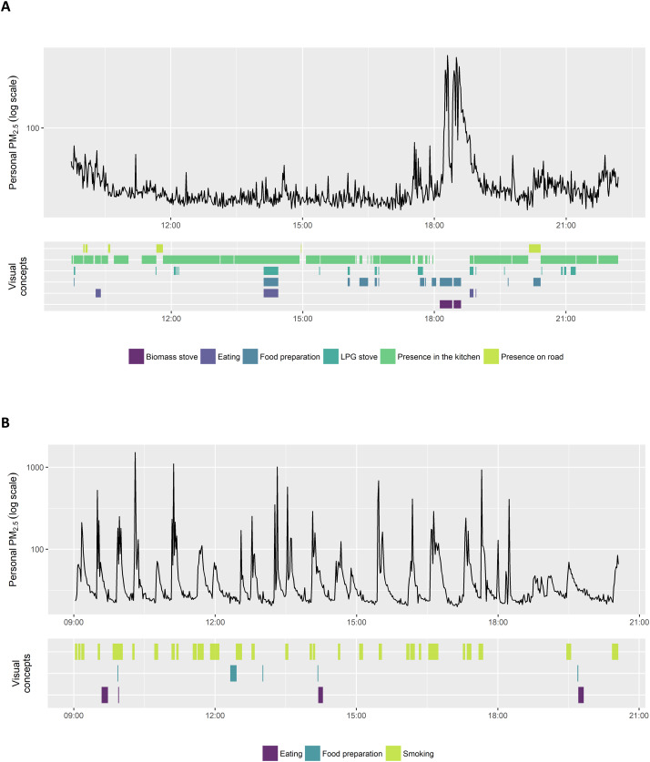

## Pratical 3 part II: See what your camera sees

We now want to extract the raw images from your camera. We'll perform the following from your `scripts` folder.

```
$ cd ../scripts
```

* Plug in your camera. To download the photos:

```
$ python3 autographer.py --download True --destDir /Users/<yourName>/OxfordImageBrowser/images/me
```

* Then generate resized versions of your photos. You first need to install 'imagemagick' via Homebrew. 

```
$ brew install imagemagick
```

If you don't have Homebrew, do:
```
/usr/bin/ruby -e "$(curl -fsSL https://raw.githubusercontent.com/Homebrew/install/master/install)"
```

Then to resize: (this will take about 10 minutes to run)
```
$ bash create_thumbnails.sh /Users/<yourName>/OxfordImageBrowser/images/me
```


* Now you can open `OxfordImageBrowser` and annotate your own data based on the instructions in `annotation.pdf`. 


### Annotating your own data

After annotating your own data using the scheme `annotation.csv`, please perform the following annotation exercises. 

<!-- 1. `7class.csv`: similar to what you did with `annotation.csv`. -->

1. `social.csv`: annotate events which you think are of a social nature (e.g. having lunch with friends) versus those which are not. 

2. `free_text.csv`: In the previous exercises, you have been confined by the definition of the labels to define 'events' / 'activities' within your day. In this case, could you come up with your own description or annotation labels and divide up your image timeline according to what feels most natural to you? You would need to put your event labels / descriptions into a csv file, and drag these to label your events. The current `free_text.csv` has been provided as an example but be creative.

3. Write a 1-liner summary for each day. Save this as a `per_day.csv` file where you have one line per row. Divide up your time line 

At the end of these exercises, you should have 4 annotation csvs saved in your `OxfordImageBrowser/annotation/me` directory.

<!-- browser_dir = '/Users/<yourName>/OxfordImageBrowser/annotation/me/' -->

Copy the `me-annotation.csv` file over to your `wearables/data` folder. 


Now unzip your `.csv.gz` file if you haven't done so already. 

```
gunzip ../../data/myAcc-timeSeries.csv.gz
```


Finally, we want to check the model predictions against your true annotations. 

```
$ cd ../../prac3
$ python check_annotations.py ../data/myAcc-timeSeries.csv ../data/me-annotation.csv --plotFile check_results.png
```

Inspect `plot.png` in your `data` folder and various `.png` generated in your `prac3` folder to see how the model has done!


### Uncodeable Activities

In your resulting time-series file, you might notice that some of your annotations are 'uncodeable'. Here are some ways to fix this. 

1. Sleep

Do the following if you want your annotated time series to have 'sleep' events. 

Open your annotations file at `practicals/data/me-annotation.csv` and manually change the label of the events you believe correspond to your sleeping hours into `7030 sleeping`.

2. Other Events

Do the following if you notice that there are other events in your time series which you have annotated but appears to be 'uncodeable' in your plot.

Open the labels file at `prac3/label-dictionary.csv` and manually append the table. 

For example, 'leisure;recreation;outdoor;15533 rock or mountain climbing' is not currently in the label dictionary. Append the table, putting 'leisure;recreation;outdoor;15533 rock or mountain climbing' in the 'annotation' column, and a category which you feel is appropriate under the 'NatComms-label-simplified' column (in this case I've assigned the latter as moderate):


## Wiping images from your camera!
You should have loaded your images onto your computer by now so you can safely delete the data from you camera!

Plug your camera in, and go to `practicals/scripts/`:

```
$ python autographer.py --setup True
```

Notice that this command is the same one you ran in your very first practical to set up the camera: it does two things: 1. wipe data from device, 2. time-sync with your computer.

**Handin:** Return the camera and accelerometer to Hang by the end of the practical. She will take care of clearing your accelereometer data. 


# Visualizing your data
For this practical, we wish for you to produce some visualizations to share in a presentation. This practical is open-ended in nature, you can explore any topic as the basis of your visualization according to your interests.

## Timeline

Prepare a timeline to illulstrate your days. 

Taken from Nature news feature ['The lab that knows where your time really goes'](https://www.nature.com/news/the-lab-that-knows-where-your-time-really-goes-1.18609) 


  


From ['Using wearable cameras to categorise type and context of accelerometer-identified episodes of physical activity'](https://ijbnpa.biomedcentral.com/articles/10.1186/1479-5868-10-22), Doherty et al. 


From ['Wearable camera-derived microenvironments in relation to personal exposure to PM2.5'](https://www.sciencedirect.com/science/article/pii/S0160412018301478), Salmon et al. 


## Side-by-side

Compare the data captured by the two devices (camera vs accelerometer) when you are performing different activities. Prepare a table of different activities, e.g. 'sitting', 'eating', 'walking' and show a side-by-side comparison of the two sources of data. 

Here is a comparison of the activities 'typing on computer Vs. typing on phone' as captured by the two devices. ['Are Accelerometers for Activity Recognition a Dead-end?'](https://arxiv.org/pdf/2001.08111.pdf), Tong et al. 


 

## Propose your own task
The above is an example from last year.

If none of the above visualizations inspire you, feel free to propose and pursue your own idea.

 Some ideas might be:

 * Compare the different annotation schema you had used

 * Look into the distribution of activities in your data 