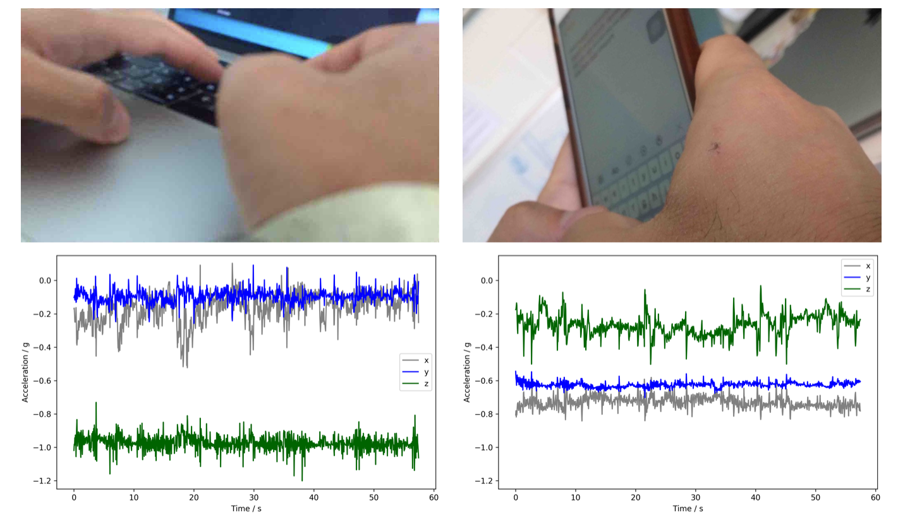

# Practical 5: Visualizing your data
[Catherine Tong, Aiden Doherty]

The first four practicals covered introductory topics in collecting and processing your sensor data for health-related analysis. For this practical, we wish for you to produce some visualizations to share in a presentation this afternoon. This practical is open-ended in nature, you can explore any topic as the basis of your visualization according to your interests.

## Timeline

Prepare a timeline to illulstrate your days. 

Taken from Nature news feature ['The lab that knows where your time really goes'](https://www.nature.com/news/the-lab-that-knows-where-your-time-really-goes-1.18609) 

  

\pagebreak

From ['Using wearable cameras to categorise type and context of accelerometer-identified episodes of physical activity'](https://ijbnpa.biomedcentral.com/articles/10.1186/1479-5868-10-22), Doherty et al. 

\pagebreak

From ['Wearable camera-derived microenvironments in relation to personal exposure to PM2.5'](https://www.sciencedirect.com/science/article/pii/S0160412018301478), Salmon et al. 

\pagebreak

## Side-by-side

Compare the data captured by the two devices (camera vs accelerometer) when you are performing different activities. Prepare a table of different activities, e.g. 'sitting', 'eating', 'walking' and show a side-by-side comparison of the two sources of data. 

Here is a comparison of the activities 'typing on computer Vs. typing on phone' as captured by the two devices. ['Are Accelerometers for Activity Recognition a Dead-end?'](https://arxiv.org/pdf/2001.08111.pdf), Tong et al. 

## Propose your own task

If none of the above visualizations inspire you, feel free to propose and pursue your own idea.

 Some ideas might be:

 * Compare the different annotation schema you had used

 * Look into the distribution of activities in your data 

